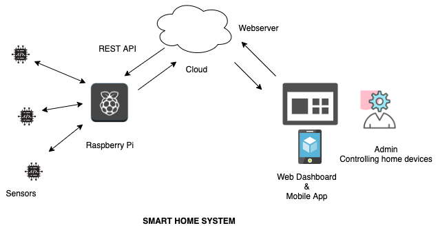

# Django Dashboard

# Reached Nagpur on 17th June

Dashboard project which runs command on IoT Platform and collect information.

#Gaurav's Master


# wiTTyMinds Changes master


For required libraries we added requirements.txt file in this project, you just to follow this command.

## Running the Project Locally

First, clone the repository to your local machine:

```bash
git clone https://github.com/wittymindstech/IoTDashBoard.git
```

Install the requirements:

```bash
pip install -r requirements.txt
```

Apply the migrations:

```bash
python manage.py migrate
```

Finally, run the development server:

```bash
python manage.py runserver
```

The project will be available at **127.0.0.1:8000**.





**If you got error follow this link** [Stackoverflow Link](https://stackoverflow.com/questions/7225900/how-to-install-packages-using-pip-according-to-the-requirements-txt-file-from-a "Stackoverflow Link")


------------

**In this project there are three main funtionality:**

- Login


- Register 


- Dashboard


